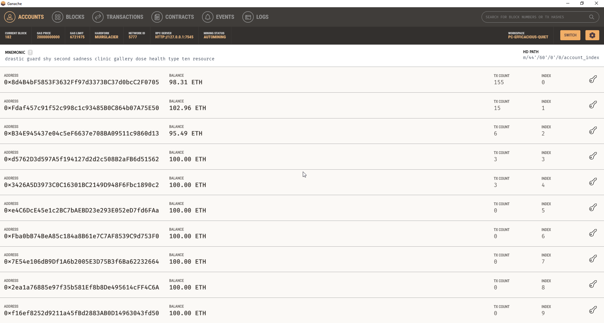
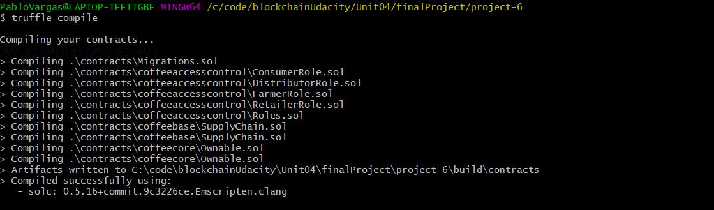
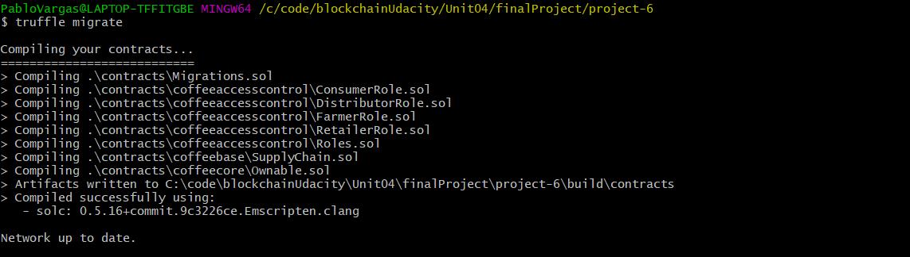
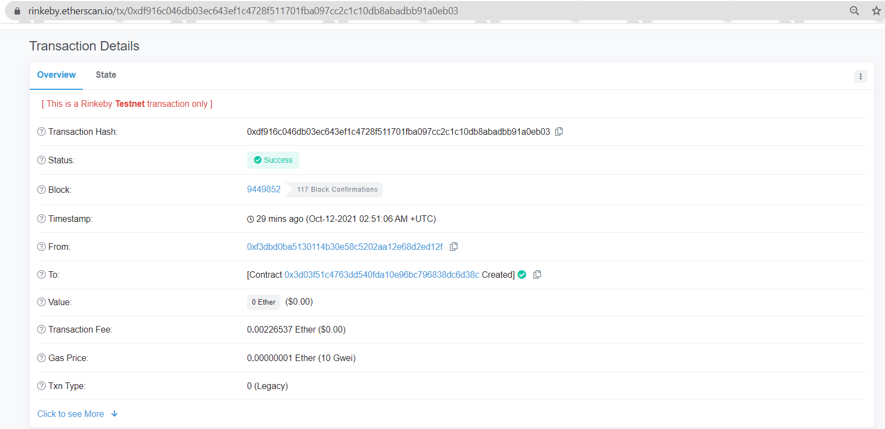
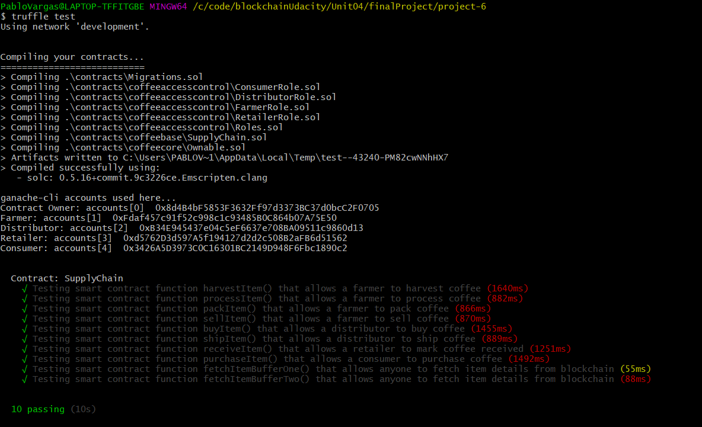
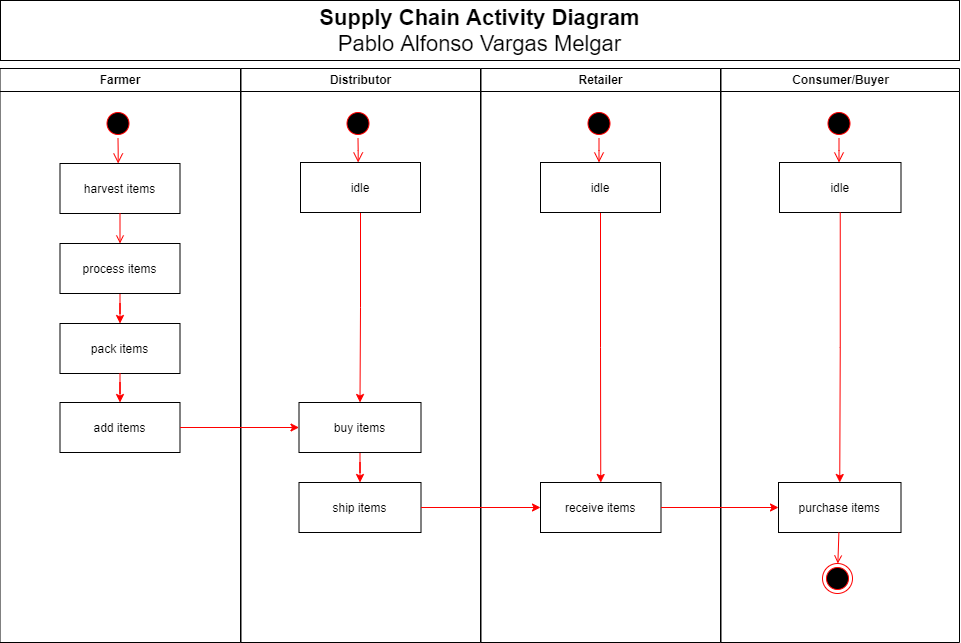
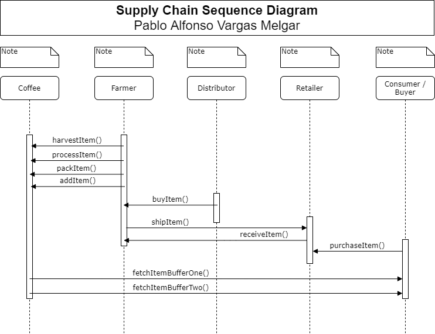
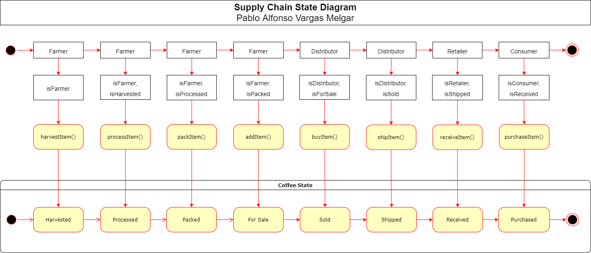
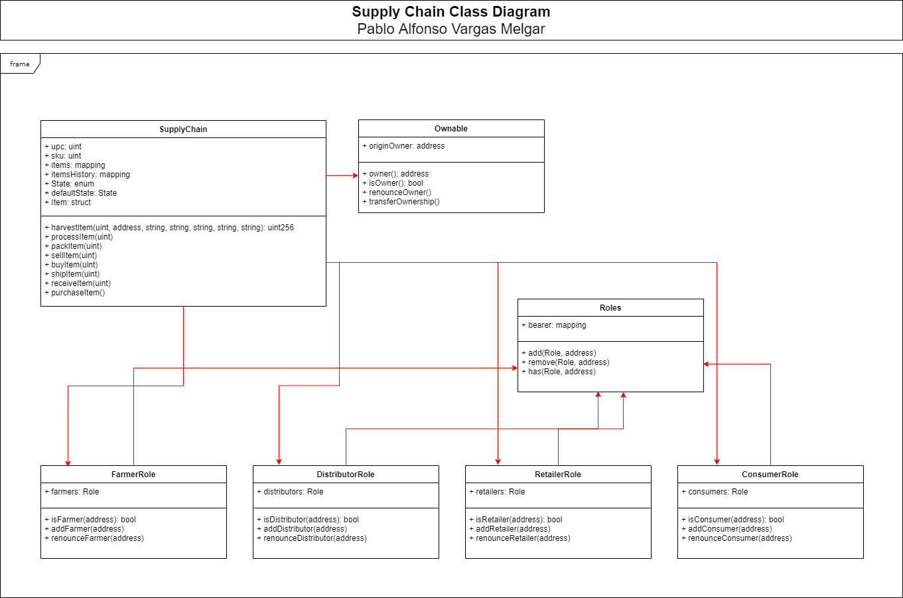

# Supply chain & data auditing

This repository containts an Ethereum DApp that demonstrates a Supply Chain flow between a Seller and Buyer. The user story is similar to any commonly used supply chain process. A Seller can add items to the inventory system stored in the blockchain. A Buyer can purchase such items from the inventory system. Additionally a Seller can mark an item as Shipped, and similarly a Buyer can mark an item as Received.

The DApp User Interface when running should look like...


## Getting Started

These instructions will get you a copy of the project up and running on your local machine for development and testing purposes. See deployment for notes on how to deploy the project on a live system.

### Prerequisites

Please make sure you've already installed ganache-cli, Truffle and enabled MetaMask extension in your browser.

```
Give examples (to be clarified)
```

### Installing

> The starter code is written for **Solidity v0.4.24**. At the time of writing, the current Truffle v5 comes with Solidity v0.5 that requires function *mutability* and *visibility* to be specified (please refer to Solidity [documentation](https://docs.soliditylang.org/en/v0.5.0/050-breaking-changes.html) for more details). To use this starter code, please run `npm i -g truffle@4.1.14` to install Truffle v4 with Solidity v0.4.24. 

A step by step series of examples that tell you have to get a development env running

Clone this repository:

```
git clone https://github.com/pablinchapin/EthereumDappTrackingItemsSupplyChain
```

Change directory to ```project-6``` folder and install all requisite npm packages (as listed in ```package.json```):

```
cd project-6
npm install
```

Launch Ganache:

```

```



In a separate terminal window, Compile smart contracts:

```
truffle compile
```




This will create the smart contract artifacts in folder ```build\contracts```.

Migrate smart contracts to the locally running blockchain, ganache-cli:

```
truffle migrate --reset --network rinkeby
```




======================

Network name:    'rinkeby'

Network id:      4

Block gas limit: 29970705 (0x1c95111)


1_initial_migration.js
======================

   Deploying 'Migrations'
   ----------------------
   > transaction hash:    0xdf916c046db03ec643ef1c4728f511701fba097cc2c1c10db8abadbb91a0eb03

   > Blocks: 0            Seconds: 0

   > Blocks: 0            Seconds: 4

   > contract address:    0x3D03f51C4763Dd540fdA10E96BC796838Dc6D38C

   > block number:        9449852

   > block timestamp:     1634007066

   > account:             0xF3DbD0ba5130114b30e58c5202aA12e68d2ED12f

   > balance:             9.98341503

   > gas used:            226537 (0x374e9)

   > gas price:           10 gwei

   > value sent:          0 ETH

   > total cost:          0.00226537 ETH


   Saving migration to chain.

   Saving migration to chain.

   Saving artifacts
   -------------------------------------
   Total cost:          0.00226537 ETH


2_deploy_contracts.js
=====================

   Deploying 'FarmerRole'
   ----------------------
   > transaction hash:    0x059078257b51af0d43244f6d0e11d6c92a588bafc8b7f1603e127d91a118c389

   > Blocks: 0            Seconds: 0

   > Blocks: 1            Seconds: 12

   > contract address:    0x4E582D4ec7e3f26BdeC449C4D9Db97f9C7cBA96b

   > block number:        9449854

   > block timestamp:     1634007096

   > account:             0xF3DbD0ba5130114b30e58c5202aA12e68d2ED12f

   > balance:             9.97966706

   > gas used:            329034 (0x5054a)

   > gas price:           10 gwei

   > value sent:          0 ETH

   > total cost:          0.00329034 ETH


   Deploying 'DistributorRole'
   ---------------------------
   > transaction hash:    0xf398ca22dadb68d6bd1316b34b787ded995d0c5b774a93bfd0f819ffd6c1590c

   > Blocks: 0            Seconds: 0

   > Blocks: 1            Seconds: 12

   > contract address:    0xa7C6397107598Fd1c69578f96A6e9788d8aAc8c0

   > block number:        9449855

   > block timestamp:     1634007111

   > account:             0xF3DbD0ba5130114b30e58c5202aA12e68d2ED12f

   > balance:             9.97636364

   > gas used:            330342 (0x50a66)

   > gas price:           10 gwei

   > value sent:          0 ETH

   > total cost:          0.00330342 ETH


   Deploying 'RetailerRole'
   ------------------------
   > transaction hash:    0xbcf17d974d4ae6fc0d1f626ff74b3224cfde3ed14e662f52d5dc0c5aa7c2b7ed

   > Blocks: 0            Seconds: 0

   > Blocks: 0            Seconds: 12

   > contract address:    0x0DD824d6Ba523212EdEaE58C081CcF5108BB8104

   > block number:        9449856

   > block timestamp:     1634007127

   > account:             0xF3DbD0ba5130114b30e58c5202aA12e68d2ED12f

   > balance:             9.97307306

   > gas used:            329058 (0x50562)

   > gas price:           10 gwei

   > value sent:          0 ETH

   > total cost:          0.00329058 ETH


   Deploying 'ConsumerRole'
   ------------------------
   > transaction hash:    0x51da8107468219f36a103a967b91ec27847fdfd79da7b919a13ba53dd4942d17

   > Blocks: 0            Seconds: 0

   > Blocks: 0            Seconds: 8

   > contract address:    0x6eCcF9262f5ecb65E74EECCc6f565DF024160409

   > block number:        9449857

   > block timestamp:     1634007142

   > account:             0xF3DbD0ba5130114b30e58c5202aA12e68d2ED12f

   > balance:             9.96978248

   > gas used:            329058 (0x50562)

   > gas price:           10 gwei

   > value sent:          0 ETH

   > total cost:          0.00329058 ETH


   Deploying 'SupplyChain'
   -----------------------
   > transaction hash:    0xa16220709f271c3303a23e13736254f72467abab191036952560b97f2b9d2c64

   > Blocks: 0            Seconds: 0

   > Blocks: 0            Seconds: 8

   > contract address:    0x51577DD8264A12B4722df7d5177D0D9ae7691B7f

   > block number:        9449858

   > block timestamp:     1634007157

   > account:             0xF3DbD0ba5130114b30e58c5202aA12e68d2ED12f

   > balance:             9.93424981

   > gas used:            3553267 (0x3637f3)

   > gas price:           10 gwei

   > value sent:          0 ETH

   > total cost:          0.03553267 ETH
   

   Saving migration to chain.

   Saving migration to chain.

   Saving artifacts

   -------------------------------------
   Total cost:          0.04870759 ETH


Summary
=======
Total deployments:   6

Final cost:          0.05097296 ETH




Test smart contracts:

```
truffle test
```

All 10 tests should pass.



In a separate terminal window, launch the DApp:

```
npm run dev
```

## Built With

* [Ethereum](https://www.ethereum.org/) - Ethereum is a decentralized platform that runs smart contracts
* [Truffle Framework](http://truffleframework.com/) - Truffle is the most popular development framework for Ethereum with a mission to make your life a whole lot easier.


## UML

### Activity Diagram


### Sequence Diagram


### State Diagram


### Class Diagram (Data Model)



## Authors

* Pablo Alfonso Vargas Melgar

## Acknowledgments

* Solidity
* Ganache-cli
* Truffle